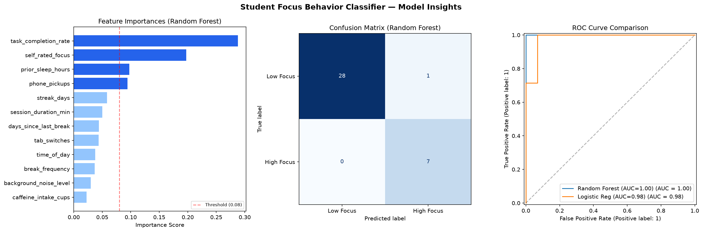
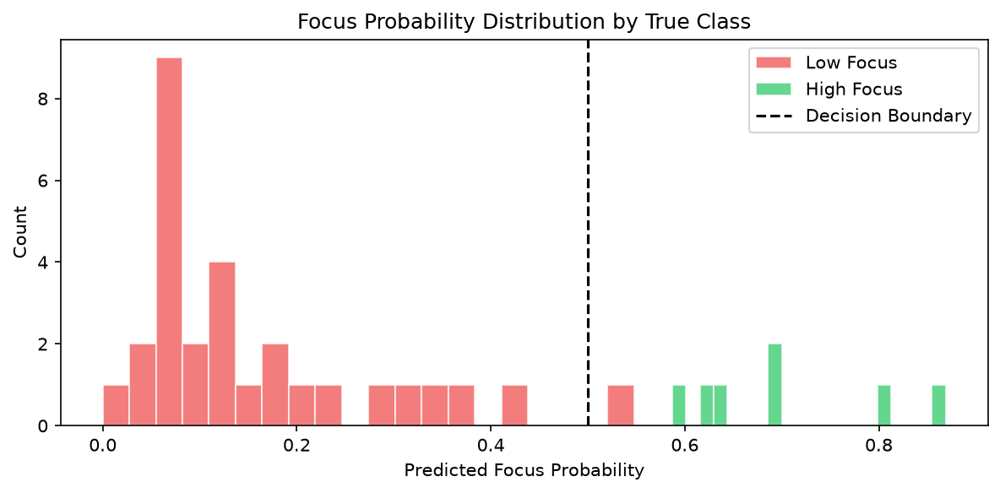

# Student Focus Behavior Classifier

> A behavioral machine learning system that predicts study session focus quality using 12 behavioral signals and identifies the most influential factors behind focus patterns.

---

## Overview

Traditional productivity tools measure **time spent studying**, but they often fail to measure **quality of focus**.

This project builds a machine learning classifier that analyzes student study-session behavior and predicts:

* High-focus session
* Low-focus session

The system also provides feature importance analysis to understand which behavioral signals contribute most to predictions.

---

## Problem Statement

Can we predict whether a study session will be productive using measurable behavioral patterns?

The model analyzes signals such as:

* Phone usage
* Tab switching
* Sleep duration
* Task completion
* Break patterns
* Self-rated focus
* Study consistency

The goal is not only prediction but also understanding which behaviors are associated with better focus outcomes.

---

## System Architecture

```
Student Session Data
        |
        v
Data Preprocessing
(Label Encoding + Feature Preparation)
        |
        v
Machine Learning Models
        |
        +----------------+
        |                |
        v                v
Logistic Regression   Random Forest
(Baseline)            (Selected Model)
        |
        v
Performance Evaluation
        |
        v
Feature Importance Analysis
        |
        v
Focus Prediction + Behavioral Insights
```

---

## Dataset

The project uses a behavioral study-session dataset containing:

* 180 study session records
* 12 behavioral input features
* Binary classification target

Target variable:

```
high_focus
```

Values:

```
0 → Low Focus
1 → High Focus
```

---

## Features Used

| Feature                | Description                             |
| ---------------------- | --------------------------------------- |
| session_duration_min   | Total study duration                    |
| break_frequency        | Number of breaks taken                  |
| phone_pickups          | Phone interruptions during session      |
| tab_switches           | Browser/application switching frequency |
| task_completion_rate   | Percentage of completed tasks           |
| self_rated_focus       | User focus rating (1-10)                |
| background_noise_level | Study environment noise level           |
| time_of_day            | Study session timing                    |
| days_since_last_break  | Rest/fatigue indicator                  |
| caffeine_intake_cups   | Caffeine consumption                    |
| prior_sleep_hours      | Previous night sleep duration           |
| streak_days            | Consecutive study days                  |

---

## Machine Learning Approach

Two classification models were compared:

### 1. Logistic Regression

Used as a baseline model because it provides a simple and interpretable comparison.

### 2. Random Forest Classifier

Selected as the final model because it captures:

* Non-linear relationships
* Feature interactions
* Complex behavioral patterns

Model configuration:

```
Algorithm: Random Forest
Trees: 100
Maximum Depth: 6
Class Weight: Balanced
```

---

## Model Performance

Evaluation metric:

**ROC-AUC Score**

| Model               | Cross-Validation ROC-AUC |
| ------------------- | ------------------------ |
| Random Forest       | 0.928 ± 0.022            |
| Logistic Regression | 0.896 ± 0.056            |

Random Forest was selected as the final model due to stronger predictive performance.

---

## Explainability

The system provides feature importance analysis to identify the most influential behavioral signals.

Generated insights include:

* Which behaviors contribute most to predictions
* How models separate high-focus and low-focus sessions
* Probability distribution of focus predictions

---

## Output Visualizations

The pipeline automatically generates model analysis charts to understand performance and behavioral patterns.

### Model Insights

Includes:

- Feature importance ranking
- Confusion matrix
- ROC curve comparison



---

### Prediction Probability Distribution

Shows how the model separates:

- Low-focus sessions
- High-focus sessions



---

## Example Prediction

The system can predict a new study session:

Example input:

```
Session duration: 45 minutes
Phone pickups: 3
Sleep: 7.5 hours
Task completion: 82%
Study streak: 12 days
```

Example output:

```
Prediction: HIGH FOCUS
Focus Probability: 79.2%
```

---

## Project Structure

```
student-focus-classifier/

├── data/
│   ├── generate_dataset.py
│   └── student_focus_behavior.csv
│
├── outputs/
│   ├── model_insights.png
│   └── probability_distribution.png
│
├── train_model.py
├── requirements.txt
├── requirements-lock.txt
└── README.md
```

---

## Installation & Usage

### 1. Clone Repository

```bash
git clone <repository-url>
cd student-focus-classifier
```

### 2. Install Dependencies

```bash
pip install -r requirements.txt
```

### 3. Generate Dataset (Optional)

```bash
python data/generate_dataset.py
```

### 4. Train and Evaluate Model

```bash
python train_model.py
```

The generated charts will be saved inside:

```
outputs/
```

---

## Tech Stack

* Python
* Pandas
* NumPy
* Scikit-learn
* Matplotlib

---

## Future Improvements

Possible extensions:

* Real-time focus tracking using webcam signals
* Larger real-world student behavior dataset
* Personalized productivity recommendations
* Deep learning comparison
* Deployment as a web application

---

## Key Learning Outcomes

Through this project:

* Built an end-to-end ML classification pipeline
* Compared multiple machine learning algorithms
* Applied preprocessing techniques
* Evaluated models using ROC-AUC
* Implemented explainable ML using feature importance
* Created reproducible ML workflow

---

## Author

Built as an ML portfolio project focused on applying machine learning to behavioral analytics.

```
Machine Learning | Behavioral Analytics | Explainable AI
```
